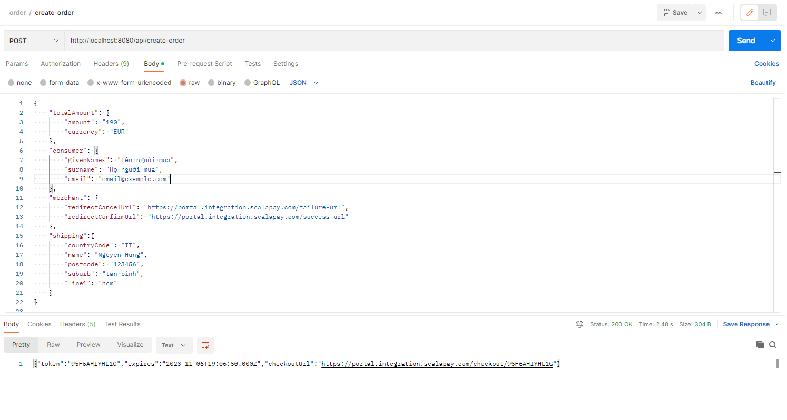

# a-simple-app-using-the-3rd-party-API
# Hướng dẫn chạy ứng dụng

## Cài đặt

Trước tiên, bạn cần cài đặt Java và Maven.

1. [Cài đặt Java](https://www.oracle.com/java/technologies/javase-downloads.html)
2. [Cài đặt Maven](https://maven.apache.org/download.cgi)

# Chạy chương trình
Tải mã nguồn
```bash
git clone https://github.com/hunghuu19012001/a-simple-app-using-the-3rd-party-API.git

```
Di chuyển vào thư mục dự án
```bash
cd a-simple-app-using-the-3rd-party-API
```
Chạy ứng dụng
```bash
mvn spring-boot:run
```
Hoặc có thể chạy dự án bằng Intellij IDEA( cần cài đặt các plugin Spring Boot).
## Kiểm tra kết quả

Dữ liệu ví dụ: 
```bash
{
    "totalAmount": {
        "amount": "190",
        "currency": "EUR"
    },
    "consumer": {
        "givenNames": "Tên người mua",
        "surname": "Họ người mua",
        "email": "email@example.com"
    },
    "merchant": {
        "redirectCancelUrl": "https://portal.integration.scalapay.com/failure-url",
        "redirectConfirmUrl": "https://portal.integration.scalapay.com/success-url"
    },
    "shipping":{
        "countryCode": "IT",
        "name": "Nguyen Hung",
        "postcode": "123456",
        "suburb": "tan binh",
        "line1": "hcm"
    }
}
```
Kết quả trả về:
```bash
{"token":"95F6AHIYHL1G","expires":"2023-11-06T19:06:50.000Z","checkoutUrl":"https://portal.integration.scalapay.com/checkout/95F6AHIYHL1G"}
```
```bash

```


